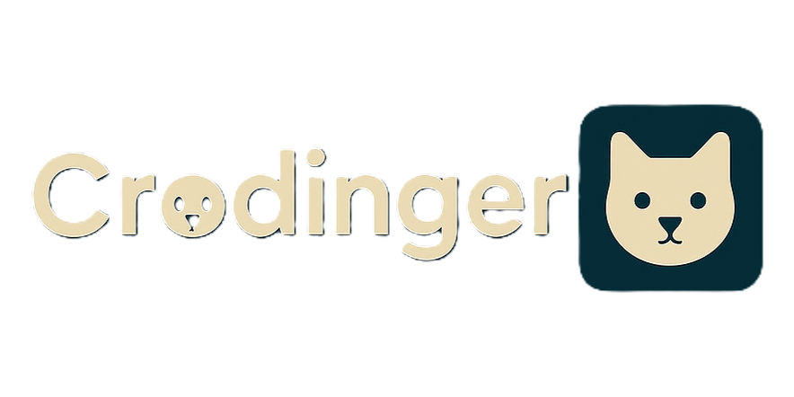

# 🔐 SafeZone - Güvenli Mesajlaşma Uygulaması

<div align="center">


<p align="center">
  
</p>

**Uçtan Uca Şifreli Mesajlaşma Uygulaması**

</div>

## 📱 Proje Hakkında

SafeZone, kullanıcı kimlik doğrulaması olmadan çalışan, uçtan uca şifreli (E2EE) bir mobil mesajlaşma uygulamasıdır. Kullanıcıların fotoğraflarından benzersiz kriptografik anahtar çiftleri üreterek, güvenli iletişim sağlar.

### ✨ Temel Özellikler

- 🔒 **Uçtan Uca Şifreleme**: Elliptic Curve Cryptography (ECC) ile güvenli mesajlaşma
- 📸 **Fotoğraf Tabanlı Anahtar Üretimi**: Kullanıcı fotoğrafından benzersiz kriptografik anahtarlar
- 🚫 **Kimlik Doğrulama Gerektirmez**: Auth sistemine ihtiyaç duymayan basit kullanım
- 💬 **Gerçek Zamanlı Mesajlaşma**: Firebase Firestore ile anlık mesaj senkronizasyonu
- 📱 **Cross Platform**: iOS ve Android desteği

## 🛠️ Teknoloji Yığını

### Frontend
- **React Native** - Mobil uygulama geliştirme
- **Expo Router** - Navigasyon ve routing
- **NativeWind** - Tailwind CSS tabanlı styling
- **Zustand** - State management

### Backend & Güvenlik
- **Firebase Firestore** - NoSQL veritabanı
- **Expo Crypto** - Kriptografik işlemler
- **Elliptic.js** - ECC şifreleme
- **Expo Secure Store** - Güvenli yerel depolama

### Geliştirme Araçları
- **TypeScript** - Tip güvenliği
- **ESLint & Prettier** - Kod kalitesi
- **Expo Camera** - Kamera entegrasyonu

## 🚀 Kurulum

### Önkoşullar
- Node.js (v16 veya üzeri)
- Expo CLI
- Android Studio / Xcode (fiziksel cihaz testleri için)

### Adımlar

1. **Projeyi klonlayın**
   ```bash
   git clone <repository-url>
   cd SafeZone
   ```

2. **Bağımlılıkları yükleyin**
   ```bash
   npm install
   ```

3. **Firebase yapılandırması**
   - `google-services.json` dosyasını Android için ekleyin
   - Firebase proje ayarlarını yapılandırın

4. **Uygulamayı başlatın**
   ```bash
   npm start
   ```

## 📂 Proje Yapısı

```
SafeZone/
├── app/                    # Expo Router ekranları
│   ├── (auth)/            # Kimlik doğrulama ekranları
│   ├── (tabs)/            # Ana uygulama sekmeleri
│   └── chat/              # Sohbet ekranları
├── src/
│   ├── components/        # Yeniden kullanılabilir bileşenler
│   ├── services/          # API ve servis katmanları
│   │   ├── CryptoService.ts    # Şifreleme işlemleri
│   │   ├── FirebaseService.ts  # Firebase etkileşimleri
│   └── types/             # TypeScript tip tanımları
├── assets/                # Görseller ve kaynaklar
└── store/                 # Zustand state management
```

## 🔧 Kullanım

### İlk Kurulum
1. Uygulamayı açın
2. Benzersiz bir kullanıcı adı seçin
3. Profil fotoğrafınızı çekin (anahtar üretimi için)
4. Kriptografik anahtar çiftiniz otomatik oluşturulur

### Mesajlaşma
1. Kullanıcı listesinden sohbet etmek istediğiniz kişiyi seçin
2. Mesajlarınız otomatik olarak şifrelenir
3. Yalnızca siz ve alıcı mesajları okuyabilir

## 🔐 Güvenlik Özellikleri

- **Elliptic Curve P-256**: Modern ve hızlı kriptografik eğri
- **Yerel Anahtar Depolama**: Private key'ler cihazdan çıkmaz
- **Mesaj Bazında Şifreleme**: Her mesaj ayrı ayrı şifrelenir
- **Forward Secrecy**: Geçmiş mesajlar güvende kalır

## 🎯 Gelecek Planları

- [ ] Grup sohbetleri
- [ ] Medya dosyası paylaşımı
- [ ] Mesaj silme özelliği
- [ ] Push notification desteği
- [ ] Desktop uygulaması

## 📝 Lisans

Bu proje eğitim amaçlı geliştirilmiştir ve açık kaynak kodludur.

---

<div align="center">
Güvenli iletişim için tasarlandı 🔐
</div>